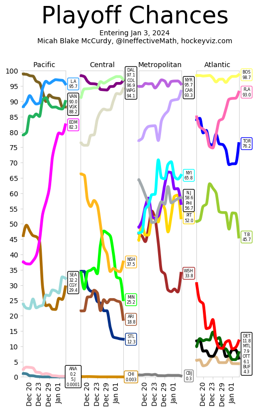

# Getting Started With Markdown

Welcome to the "Getting Started With Markdown" activity. This activity is
not intended for a grade and only exists to help you make use of the homework
templates that follow. Therefore, it should be short, sweet, and full if
rich information for reference.

To start, you probably have no problem reading this file as-is, but it
includes a lot of strange characters like **these bold characters** and *these
italics characters*. In addition, there are ~~these strange strikethrough
characters~~, and even `these inline code characters`. All of these are part
of a syntax known as Markdown, which is a lightweight markup language for
rendering basic documents like webpages. To get a feel for the full extent of
the syntax, I'd recommend [browsing this cheat sheet][cheat-sheet].

With that said, most of the markdown will be written for you in each assignment.
All you'll have to do is fill in the blanks. Of course, it can still be
challenging to read through a document that's already written, so we'll
get going with some quick tips.

## How to Create a PDF from a Markdown File

First, you can see what any markdown document looks like immediately by
following the directions at the top of [the README][readme]. This is great
because you get to preview the final product. However, we don't want you to
submit these raw Markdown documents as-is. We would much prefer you convert
them to a PDF. Right now, VSCode has a setting which automatically does this
for you every time you save. Give it a try by making a minor change to this
document and hitting save. A PDF should pop right into the same folder.
Alternatively, you can build the PDF manually by right-clicking this document
and clicking "Markdown PDF: Export (pdf)". Feel free to experiment with the
other options as well.

## How to Fill Out the Homework Templates

Now that you know how to create a PDF for submission, you probably want to know
how to fill the homework out. In general, there are only a few things you
probably ought to know.

### HTML Comments

One of which is what an HTML comment looks like. To
start, HTML comments have the following form: `<!-- this is a comment -->`.
You can tell this is a comment because it disappears when placed in a Markdown
document without the inline code symbols:

<!-- this is a comment -->

Notice how you can see the comment in the source code but not when the file
is rendered. Keep this in mind as you will see these comments at the top
of every homework template where you'll be asked to put in your name. For
example, here's what the top of Homework 1 looks like:

- **Name**: <!-- TODO: fill with first and last name (e.g., Brutus Buckeye) -->
- **Dot Number**: <!-- TODO: fill with OSU dot number (e.g., buckeye.17) -->
- **Due Date**: <!-- TODO: fill out with due date and time (e.g., 10/17 @ 3:10 PM EST) -->

When filling this out, delete each comment and replace it with the appropriate
information. For example, here's what that might look like using the prompts:

- **Name**: Brutus Buckeye
- **Dot Number**: buckeye.17
- **Due Date**: 10/17 @ 3:10 PM EST

In homework questions which ask you to write a sentence or two, you will see
a similar format. Make sure to delete the comments and replace them with your
responses.

### Code Blocks

In other cases, you may be asked to fill out a code block. Code blocks have
the following format:

```java
// TODO: fill me with code
```

To fill these out, just put your code between the "fences". For example, your
code might look like this:

```java
public static void main(String[] args) {
    System.out.println("Hello, World!");
}
```

That's it!

### Markdown Images

It's rare, but you may find that it's easier to draw a picture and include
it in your document than it is to try to convey your idea with text. To do
that, you just need to include your picture in the same folder as the
markdown file—though, it really could be anywhere. Then, to reference it,
you use the following syntax:



VSCode is quite nice and should show you paths that can be reached from this
file as you type. Regardless, if all goes well, you should see an image
embedded in the rendered file. In my case, I chose a random playoff chances
image from IneffectiveMath.

## Feel Free to Play Around With Markdown Yourself

As far as a document format, Markdown is quite nice. That said, it may take you
some getting used to. Why not use this space to mess around?

[cheat-sheet]: https://www.markdownguide.org/cheat-sheet/
[readme]: ../../README.md
